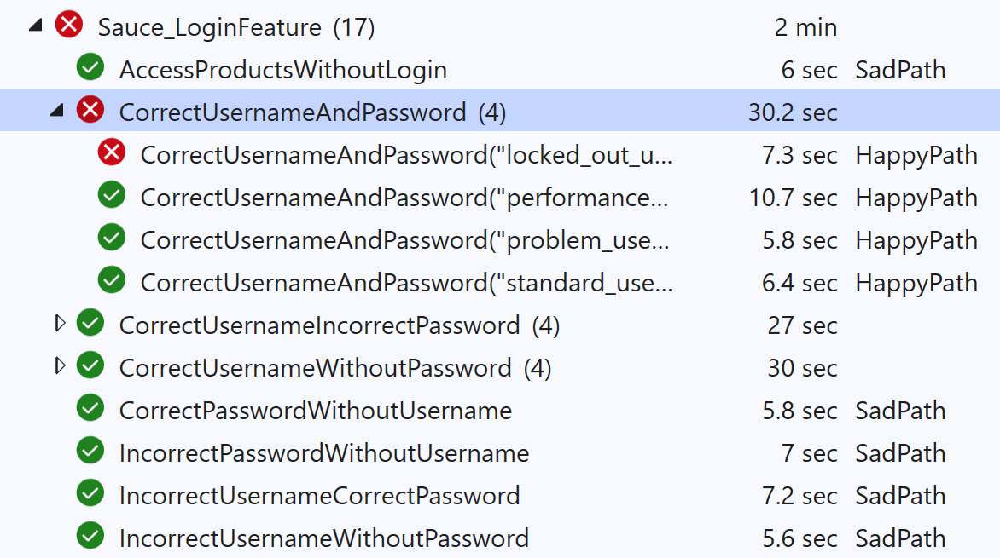
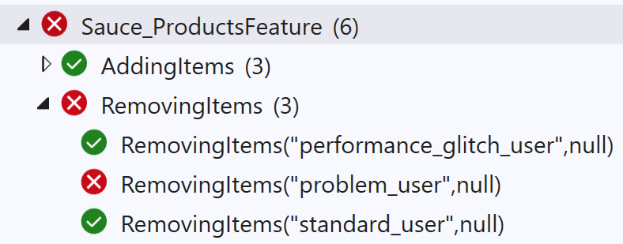
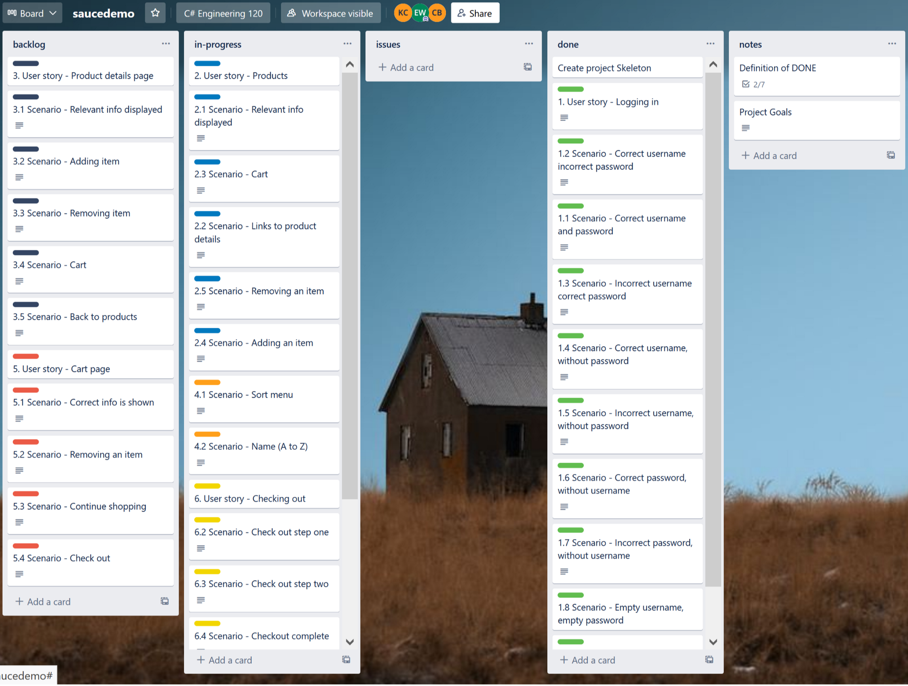

# autosauce
Mini Automated Web Testing Project - Engineering 120

# autosauce
Mini Automated Web Testing Project - Engineering 120

## Project goal
To test the website www.saucedemo.com using automated tests with Selenium and Specflow and to report any defects found

## Features tested

### Logging in

#### Happy path
Correct usernames, correct password

#### Sad paths
Correct usernames, incorrect password
Correct usernames, empty password
Incorrect username, correct password
Incorrect username, incorrect password
Incorrect usernames, empty password
Empty username, correct password
Empty username, incorrect password

### Products

Adding items
Removing items

### Checking out
#### Checking Out Step One

##### Happy path
Having entered first name, last name, postal code

##### Sad path
Empty first name, last name, and postal code
Empty first name
Empty last name
Empty postal code

#### Checking Out Step Two

## Defects found

### Logging in
locked_out_user cannot log in

### Products
problem_user cannot remove item

### Checking out

## Project progress

### Original plan

### After review
Focusing on the core features that bring the most value to the business

